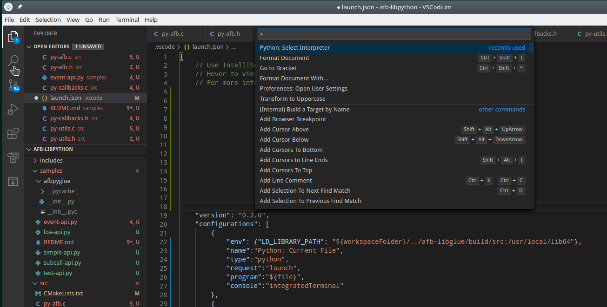

# Debugging Python with vscode from sources tree

In order to debug Python directly from VScode your should do:

* Set PYTHONPATH for python to load libafb.so
* Select Python3 (by default vscode generally select Python2)

## launch.json

Update vscode debug config with adequate PYTHONPATH

```json
        {
            "env": {"PYTHONPATH": "${workspaceFolder}/build/src"},
            "name":"Python: Current File",
            "type":"python",
            "request":"launch",
            "program":"${file}",
            "console":"integratedTerminal"
        },
```

## select Python3

For this click F1 to enter vscode command mode
type: 'Python:Select Interpretor' and chose Python 3



## run debugger

* Open one Python from vscode
* Click on debug icon and select 'Python: Current File' configuration
* Place breakpoint within your source code
* Start debugging session

`Note: Breakpoint should be introduced before debug session start.`
